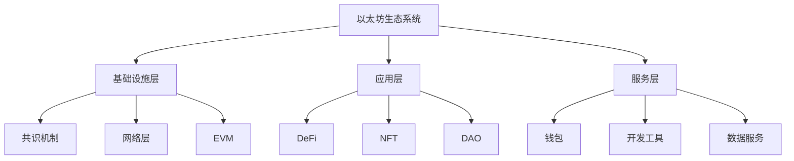

# 1. 以太坊概述

以太坊是一个开源的、去中心化的区块链平台，它不仅支持加密货币交易，还能够运行智能合约和去中心化应用（DApps）。

## 1.1 历史发展

以太坊的概念由 Vitalik Buterin 于 2013 年底首次提出，并在 2014 年 1 月的迈阿密北美比特币会议上首次公开发布。以太坊通过引入图灵完备的编程语言，极大地扩展了区块链技术的应用范围。

## 1.2 核心特点

- **智能合约平台：**支持开发者编写和部署自动执行的合约代码
- **去中心化应用：**为DApps提供运行环境和基础设施
- **以太币（ETH）：**平台原生代币，用于支付交易费用和智能合约执行
- **图灵完备：**支持复杂的程序逻辑和计算

## 1.3 技术架构

- **以太坊虚拟机（EVM）：**智能合约的运行环境，确保代码执行的一致性和安全性
- **账户系统：**包括外部账户（EOA）和合约账户两种类型
- **Gas机制：**用于计量计算资源的使用和控制交易费用
- **共识机制：**从PoW逐步过渡到PoS，提高能源效率和可扩展性

## 1.4 主要应用场景

- **去中心化金融（DeFi）：**提供借贷、交易、保险等金融服务
- **非同质化代币（NFT）：**支持数字艺术品、游戏资产等独特数字资产的创建和交易
- **去中心化自治组织（DAO）：**实现社区治理和决策的自动化
- **供应链管理：**通过智能合约实现商业流程的自动化和透明化

## 1.5 账户结构

以太坊的账户系统包含两种类型的账户，各自具有不同的特点和用途：

### 1.5.1 外部账户（EOA）

- **私钥控制：**由用户通过私钥控制
- **交易发起：**能够主动发起交易
- **状态组成：**包含余额和nonce值

### 1.5.2 合约账户

- **代码控制：**由智能合约代码控制
- **被动执行：**只能在接收到交易时执行
- **状态组成：**包含余额、代码和存储空间

## 1.6 交易结构

以太坊交易包含以下关键字段：

- **Nonce：**发送方已发送交易的序号
- **Gas Price：**交易发送方愿意支付的单位gas价格
- **Gas Limit：**交易允许消耗的最大gas量
- **To：**接收方地址
- **Value：**转移的ETH数量
- **Data：**包含合约调用数据或部署代码
- **Signature：**交易签名信息

### **什么是以太坊？**

**回答要点**

- _以太坊是一个区块链平台，支持去中心化应用（DApp）的开发和运行_

### **以太坊的概念是由谁首次提出的，并在何时？**

**回答要点**

- _以太坊的概念由 Vitalik Buterin 在 2013 年底提出，并在《比特币杂志》中发表的一篇白皮书中详细阐述。_

### **以太坊的首个公开发布是在什么时候，哪里进行的？**

**回答要点**

- _以太坊在 2014 年 1 月的迈阿密北美比特币会议上首次对外公开发布。_

### **"The DAO"是什么，以及它如何影响以太坊？**

**回答要点**

- _The DAO 是一个基于以太坊的分布式自治组织，旨在作为一个去中心化的投资基金。_
- _2016 年，由于一个安全漏洞，DAO 项目被黑客攻击，导致以太坊进行了一次重大的硬分叉。_

### **以太坊进行硬分叉的目的是什么？**

**回答要点**

- _硬分叉的目的是为了恢复因 The DAO 安全漏洞而被盗的资金，并尝试解决安全问题。_
- _这次分叉最终导致以太坊分成了两条链：ETH 和 ETC。_

### **什么是企业以太坊联盟（EEA），它成立于何时？**

**回答要点**

- _企业以太坊联盟（EEA）是一个由多家区块链初创公司、研究小组和财富 500 强公司组成的联盟，成立于 2017 年 3 月，旨在推动以太坊技术的商业应用。_

### **以太坊 2.0 与以太坊 1.0 有何不同？**

**回答要点**

- _以太坊 2.0 被视为“共识层”，采用 PoS（权益证明）作为共识机制，而以太坊 1.0 被称为“执行层”，主要负责交易的处理和执行。_
- _以太坊 2.0 还包括了一系列其他升级，如增加交易吞吐量和引入分片技术。_

### **Metamask 插件的主要功能是什么？**

**回答要点**

- _Metamask 是一个浏览器插件，允许用户通过图形界面进行交易、编写和部署合约，同时管理其以太坊钱包和账户。_

### **在以太坊中，'gas'的概念是用来做什么的？**

**回答要点**

- _在以太坊中，'gas'用来衡量执行交易或智能合约时所需的计算工作量，同时也是矿工执行这些操作所需费用的计量单位。_

### **什么是智能合约？**

**回答要点**

- _智能合约是一段存储在以太坊区块链上的代码，可以自动执行合同条款。_
- _一旦部署，智能合约的行为将不可变更，确保了合同执行的透明性和不可篡改性。_

### **如何在以太坊上创建一个账户？**

**回答要点**

- _用户可以通过安装 Metamask 等以太坊钱包软件并设置密码来创建一个账户。_
- _账户创建过程中，用户将获得一组助记词，这组助记词是恢复账户的关键。_

### **以太坊的挖矿机制是如何工作的？**

**回答要点**

- _在以太坊 1.0 中，挖矿是通过工作量证明（PoW）共识机制完成的，矿工通过解决复杂的数学问题来竞争区块的记账权。_
- _在以太坊 2.0 中，系统将转向使用权益证明（PoS），减少能源消耗。_

### **描述以太坊交易的基本组成部分。**

**回答要点**

- _以太坊的交易包括：消息的接收者、确认发送者身份的私钥签名、要转移的以太币数量、附带的数据以及 GasLimit 和 GasPrice 等参数。_

### **什么是以太坊虚拟机（EVM）？**

**回答要点**

- _以太坊虚拟机（EVM）是智能合约的执行环境，可以独立于外部系统运行代码，确保智能合约的透明和安全执行。_

### **以太坊的区块结构包括哪些部分？**

**回答要点**

- _以太坊的区块主要包括区块头、交易列表和叔区块头。_
- _区块头包含了多项重要信息，如父区块哈希、状态树根哈希等，交易列表记录了一段时间内所有被确认的交易。_

### 以太坊数据层的主要功能是什么？

**回答要点**

- 以太坊数据层的主要功能是使用 LevelDB 数据库以键值对形式存储数据，并使用 Merkle Patricia Tree（MPT）数据结构进行管理。这一层是区块链架构的基础组成部分。

### 以太坊中有哪两种类型的账户？

**回答要点**

- 在以太坊中，账户分为两种类型：外部账户和合约账户。
- 外部账户由用户创建，可以通过私钥签名发送交易。
- 合约账户由合约代码控制，只能在接收到交易时被动执行。

### 以太坊如何防止外部账户的重复支付问题？

**回答要点**

- 以太坊通过使用“nonce”字段来防止外部账户的重复支付问题。
- 每个外部账户的 nonce 字段表示该账户发出的交易数量，通过此机制确保每笔交易都是独一无二的。

### 描述以太坊的合约账户如何被创建？

**回答要点**

- 以太坊中的合约账户是通过部署智能合约来创建的。
- 这些账户不由私钥管理，而是由合约的部署者控制。
- 合约账户可以编写特定函数来实现所有权的转移或继承。

### 以太坊中交易的两大类别是什么？

**回答要点**

- 以太坊中的交易分为两大类：消息通信和合约创建。
- 这两种类型的交易都是由外部账户发起并提交到以太坊网络，然后通过网络传输，并最终记录在以太坊区块链上。

### 以太坊是如何实现交易签名和验证的？

**回答要点**

- 以太坊当前使用的是基于 EIP-155 的签名方案，引入了交易重放保护机制。
- 这包括在交易数据结构中添加链标识符，确保在一个链上创建的交易不能在其他链上重放。

### 以太坊区块的封印（Seal）过程包括哪些关键步骤？

**回答要点**

- 以太坊区块的封印过程首先包括创建一个完整的新区块，这包括填充区块头的部分属性、编排交易列表、添加 uncle 区块等。
- 封印阶段涉及计算难度值、随机数和混合哈希值，这一过程确保了区块的安全性。

### 以太坊如何处理网络中同时产生的多个区块？

**回答要点**

- 以太坊在处理同时产生的多个区块时，会选择总难度最高的链作为主链。
- 这通过比较不同链的区块难度值来决定哪个链包含更多的累计工作量，从而被选为主链。

### 描述以太坊 P2P 网络中的 Kademlia（Kad）协议的基本工作原理？

**回答要点**

- Kademlia 协议是基于分布式哈希表的 P2P 网络协议，使用异或距离来测量节点间距离，并通过维护一个路由表来实现节点查找和资源定位。
- 节点通过向距离目标节点最近的其他节点发送查询请求来查找目标节点或数据。

### 以太坊节点如何实现数据的存储和检索？

**回答要点**

- 以太坊节点通过 Kademlia 协议实现数据的存储和检索。
- 数据存储时，将数据的副本存储在距离数据键最近的 k 个节点上。
- 数据查找时，节点基于数据键进行搜索，目标是找到实际存储该数据的节点或更接近目标数据的节点。
